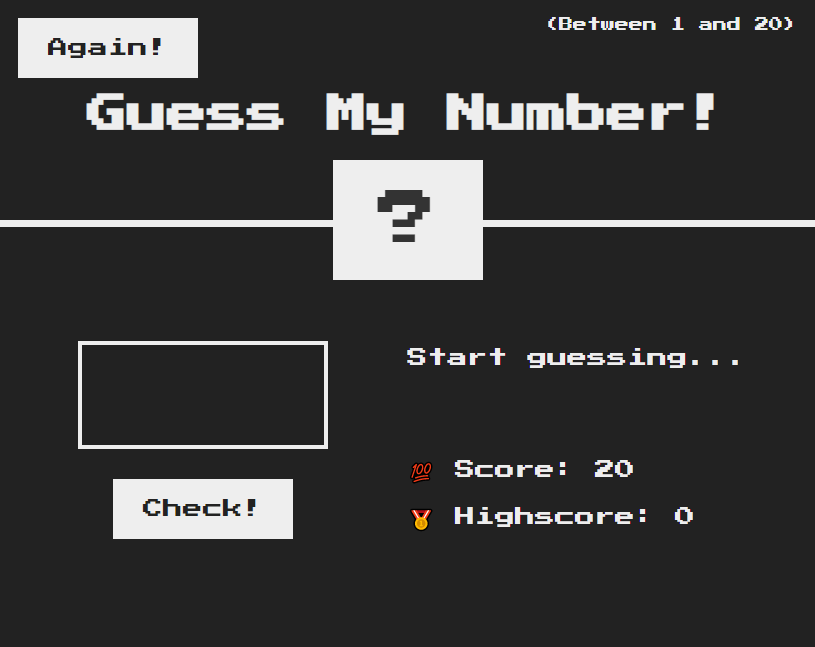
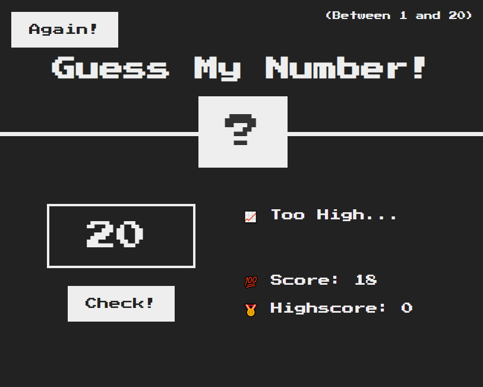
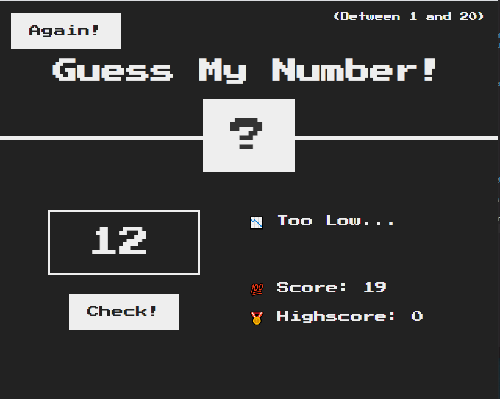
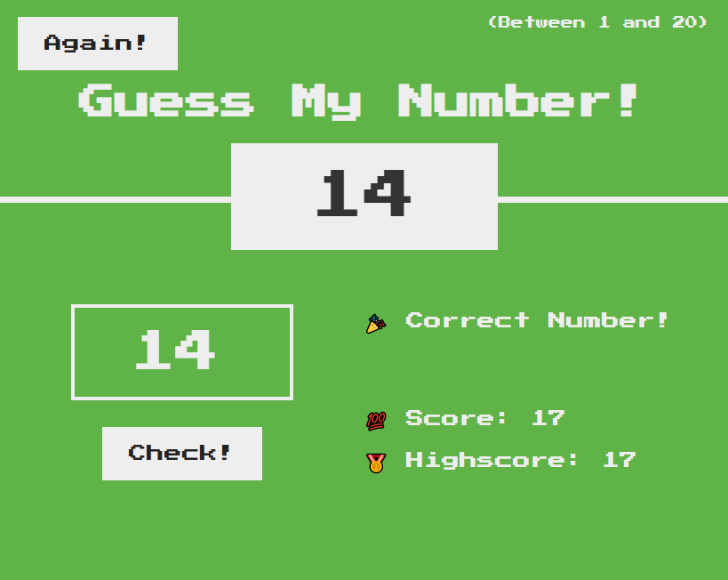

<h2>Guess My Number!</h2>

  This is a game developed with HTML, CSS and JavaScript in "The Complete
  JavaScript Course" by Jonas Schmedtmann.

  In this game there's a random number between 1 and 20 to be discovered. The
  user can input their guesses in the field and see where it goes 😃

  This project was my first experience with DOM Manipulation, it gave me a great
  oportunity to work with it.

<h2>Final Project:</h2>

Initial Page

When the user's guess is too high...

When the user's guess is too low...

Finally, when the number is right!!!

Made with 💖 by Marília Pacífico.

